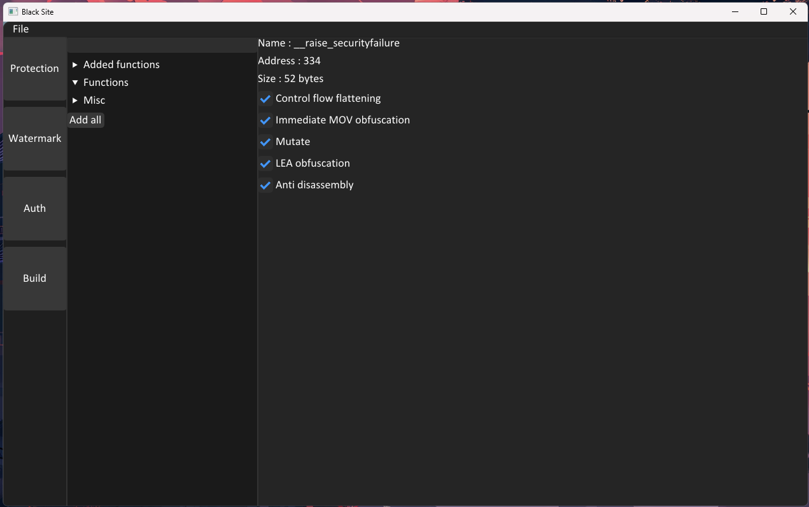
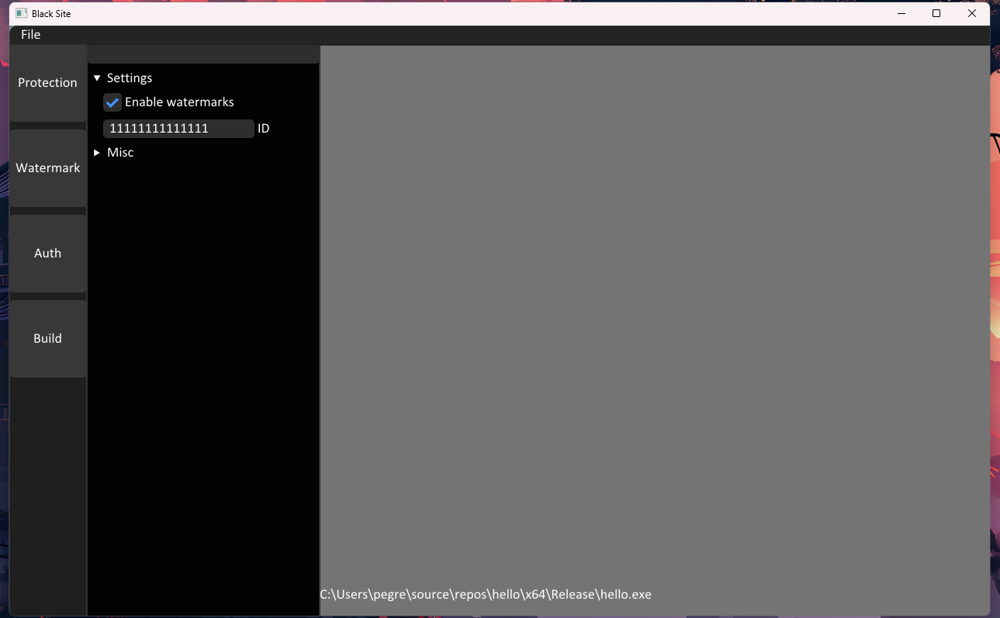
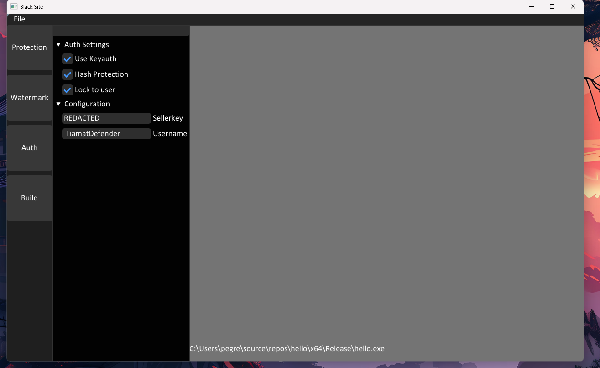
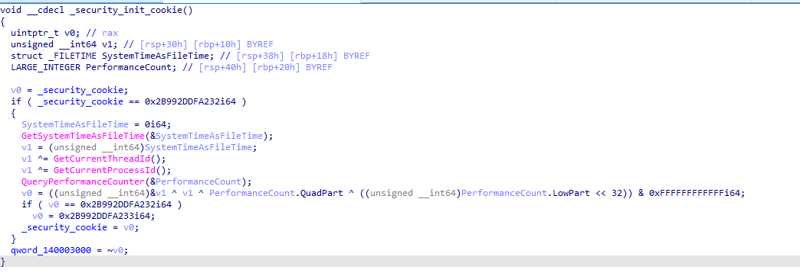
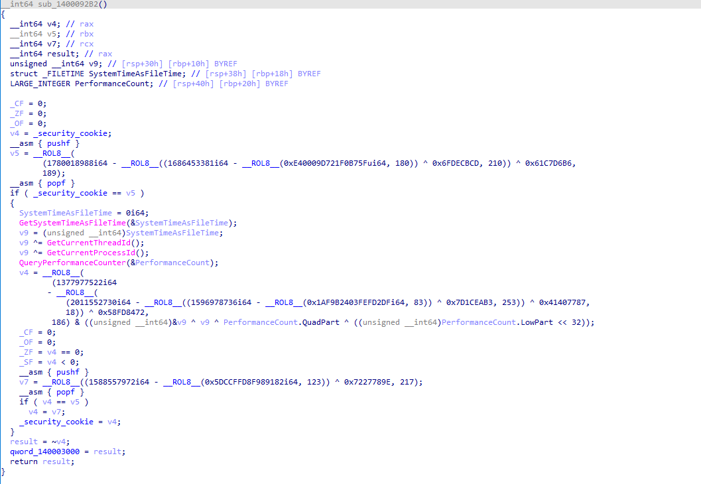
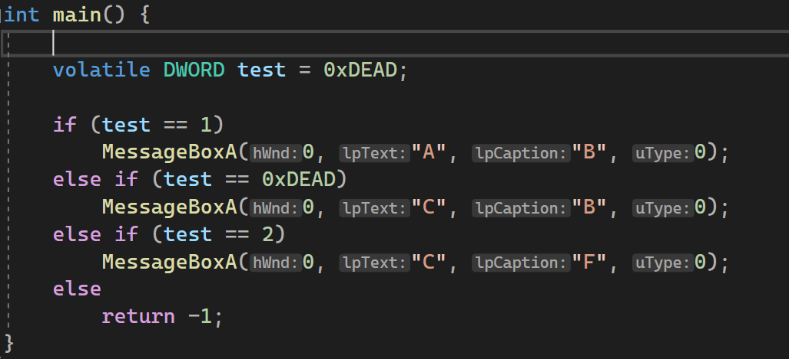
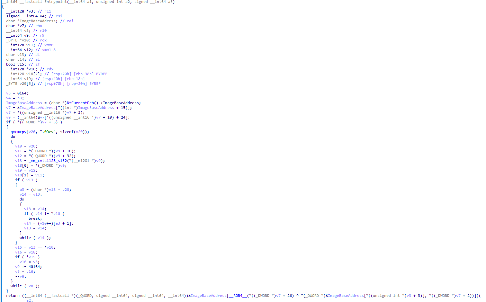
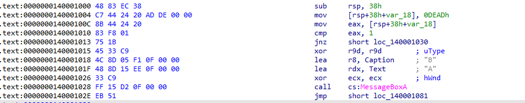
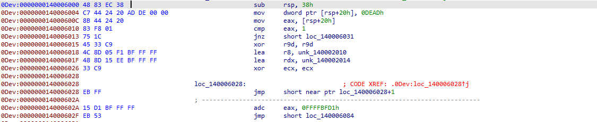
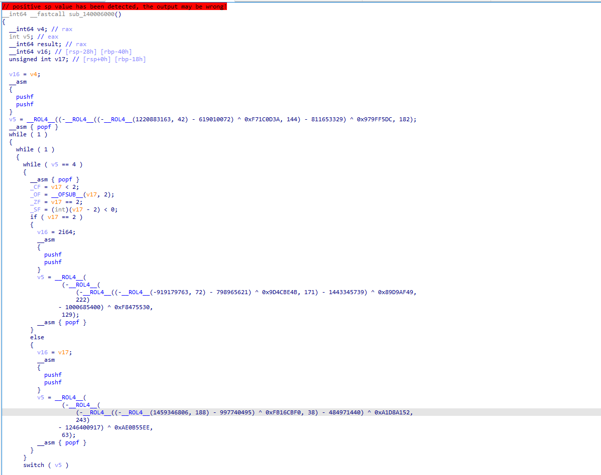

# Blacksite
**Blacksite** is a x64 binary obfuscator with integrated **KeyAuth** support for secure licensing and watermarking capabilities. It can obfuscate various PE files, including:
- .exe
- .dll
- .sys

# Overview
- [Blacksite](#blacksite)
- [Usage](#usage)
- [Features](#features)
    + [Obfuscation of immediate moves](#obfuscation-of-immediate-moves)
    + [Control flow flattening](#control-flow-flattening)
    + [ADD mutation](#add-mutation)
    + [Entry-point obfuscation](#entry-point-obfuscation)
    + [Lea obfuscation](#lea-obfuscation)
    + [Anti disassembly](#anti-disassembly)
    + [Import obfuscation](#import-obfuscation)
    + [KeyAuth Integration](#keyauth-integration)
    + [Watermarks](#watermarks)
    + [Final result](#final-result)

# Usage






1.) Load a binary by clicking `file` in the top left corner.  
2.) Add functions by expanding the `Functions` tree. (You can search by putting in the name in the search bar at the top)  
3.) Hit `built` (note: obfuscating many functions might take some time).  

# Features

### Obfuscation of immediate moves
If an immediate value is moved into a register, we obfuscate it by applying multiple bitwise operations.  
Before:
  
After:


### Control flow flattening
This increases the complexity of the program by removing the tidy program structure the compiler generated and placing the code in new, generated blocks.  
  

### ADD mutation
Mutates the `ADD` instruction syntax without changing the semantic meaning, making reverse engineering more difficult.  
Example mutation:
```asm
push rax
not rax
sub rcx, rax
pop rax
sub rcx, 1
```

### Entry point obfuscation
For `.exe` files, a custom entry point is created to decrypt the real entry point on startup. (Note: doesn't work when being manually mapped).  


### Lea obfuscation
The `lea` obfuscation technique moves a different location into a register and decrypts it later to make it harder for reverse engineers to cross-reference certain data.  
Before:
```asm
lea rcx, [0xDEAD]
```
After:
```asm
pushf
lea rcx, [1CE54]
sub rcx, EFA7
popf
```

### Anti disassembly
Inserts jump instructions to disrupt tools that decode instructions in a linear manner.  
Before:
  
After:


### KeyAuth Integration
Blacksite now supports **KeyAuth** natively, allowing you to secure your application with key-based authentication.  
- When compiling your file, you can integrate a **KeyAuth** seller id that prevents unauthorized usage.
- Integration with **KeyAuth** also provides a quick and easy way to lock a specific instance of that application to one user via md5 hash


For more details on setting up KeyAuth:
1. Ensure you've created a KeyAuth account and project (https://www.keyauth.cc).
2. Add your **seller key** to the auth section
3. ensure you have selected **use keyauth**

### Watermarks
Blacksite can also apply a custom **watermark** to your binary files, allowing you to track the origin of each build. This is useful for identifying where the software was distributed and who is using it.  
- Watermarks are inserted into specific parts of the binary and are non-intrusive, leaving the program's functionality intact.
- The watermark can include information such as the **build number**, **unique identifier**, or even **user-specific data**.

To add a watermark:
1. Specify the watermark string during the obfuscation process.
2. The watermark will be inserted at a specified location, making it invisible to the user but retrievable by authorized parties.

### Final result
Here is a sample of the `main` function after all obfuscations (except anti disassembly) are applied:


---

We would like to give credit to Alcatraz a old obfuscator we forked to build this complete obfuscation suite
